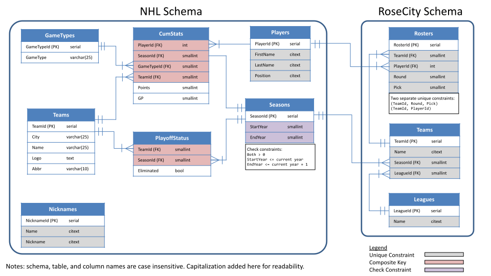

# rosecity-pools-backend

See [rosecity-pools-frontend](https://github.com/bkaas/rosecity-pools-frontend) for the background and motivation for this project.

## Back End Description

[rosecitypools.info](https://rosecitypools.info) is a [Gatsby](https://www.gatsbyjs.com/) site developed using [React](https://reactjs.org/). The goal of the project was to learn various aspects of web development. Although Gatsby was the chosen framework (well known as a static site generator), I decided to implement a back end (or api) using [Express](https://expressjs.com/) in [Node.js](https://nodejs.org/en/). Due to its popularity in the industry, availability of learning resources, and the desire to implement a PostgreSQL database, I chose this stack for my project.

The back end is based off the `express-generator` template and its development is quite minimal: basic routing, CRUD operations with PostgreSQL database, and data formatting for use in the [front end](https://github.com/bkaas/rosecity-pools-frontend).

## PostgreSQL Entity Relationship Diagram

The PostgreSQL database is split into two schemas: nhl, and rosecity. There is a lot of room for growth with this database. It currently only stores a player's cumulative stats for a given year and game type (ie. does not have knowledge of game history), and the player's games played. For the purposes of the playoff fantasy league, it meets the requirements.

**Future Growth:**
- Include game-by-game statistics.
